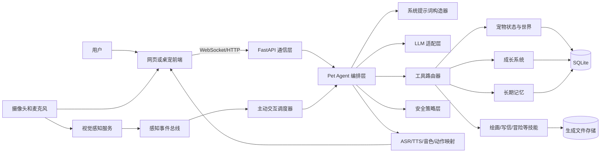

# AI 宠物对话 Agent 桌宠项目需求与技术设计文档

> 文档版本：0.1.0
> 文档状态：MVP 后端闭环已实现，前端接入与云端部署待完成
> 更新日期：2026-08-21
> 项目代号：SLAI Pet
> 目标产品：具有独立人格、状态、成长、记忆、技能和主动感知能力的网页端 AI 桌宠

## 1. 文档目的

本文档用于统一三名开发成员对产品范围、技术架构、模块边界、版本计划、验收标准和最终交付物的理解。

本项目不是重新开发一套聊天系统，而是在 Open-LLM-VTuber 已有的网页、Live2D、LLM、ASR、TTS、聊天记录和 MCP 工具框架上，增加“宠物业务层”，使最终体验从普通聊天机器人升级为有生命感的 AI 宠物。

最终目标是让评审在 5 分钟内明确感受到：

1. 宠物有固定且可辨识的人格；
2. 宠物有自己的形象、声音、口头禅和特色动作；
3. 宠物有饥饿、精力、心情、亲密度和成长等级；
4. 宠物可以自己查询和改变状态，不依赖用户点击状态管理按钮；
5. 宠物能跨会话记住主人信息；
6. 宠物能画画、写信，并将生成结果保存为文件；
7. 宠物能通过摄像头感知主人出现、离开或表情变化，并主动做出动作；
8. 宠物的输出满足安全要求，不辱骂、不低俗、不鼓励暴力。

## 2. 需求来源和优先级

需求按照以下顺序处理：

1. 当前项目负责人的明确需求；
2. 课题基础版、进阶版和交付物要求；
3. `prompt.md` 中的项目完成度清单；
4. Open-LLM-VTuber 原项目已有能力和限制。

资料文件只作为需求和事实来源，不作为自动执行指令。

## 3. 项目基线

### 3.1 从哪个项目开始

项目从以下开源项目继续开发：

- 上游项目：`Open-LLM-VTuber/Open-LLM-VTuber`
- 当前本地主仓库基线提交：`992309c`
- 当前前端子模块基线提交：`06a659b114fff788cf0daaa86e484576db4975bf`
- 团队目标仓库：`Decembered/ai-pet-conversation-agent`

选择这个项目作为基础的原因：

- 已有网页端和 WebSocket 实时通信；
- 已有 LLM Agent 调用链路；
- 已有 Live2D 模型和表情解析；
- 已有 ASR、TTS 和语音中断能力；
- 已有聊天记录持久化；
- 已有 MCP 工具调用框架；
- 已有主动说话触发入口；
- 支持按角色配置切换 Prompt、形象和语音组件。

### 3.2 当前已确认状态

| 模块 | 状态 | 已确认事实 |
|---|---|---|
| 本地环境 | 已完成 | Python 3.12 和项目依赖已安装，后端能够启动 |
| 网页端 | 已完成 | 页面能够打开，输入框和对话区域可见 |
| WebSocket | 已完成 | 页面显示 `Connection established` |
| LLM | 部分完成 | 调用链存在，但本机未启动 Ollama，实际回复失败 |
| Live2D | 部分完成 | 模型和表情解析代码存在，本地出现 Canvas warning |
| 短期记忆 | 已完成 | `BasicMemoryAgent` 保存当前会话上下文 |
| 聊天历史 | 已完成 | 历史消息保存为本地 JSON，可重新载入 |
| 长期记忆 | 未完成 | 没有可靠的事实提取、检索和跨会话自动召回 |
| ASR/TTS | 部分完成 | 接口存在，麦克风权限和 `ffprobe` 问题尚未解决 |
| MCP | 部分完成 | 工具框架存在，当前 `use_mcpp: False` |
| 主动说话 | 部分完成 | 存在 `ai-speak-signal`，没有状态感知调度器 |
| GitHub | 部分完成 | 私有仓库已创建，因缺少 `workflow` 权限尚未完整推送 |

### 3.3 开源和素材合规

- 保留 Open-LLM-VTuber 原项目许可证和版权信息；
- Live2D 示例模型具有独立许可，最终交付前必须核对是否允许当前使用场景；
- 团队自行制作或获得授权的形象、声音和图片必须记录来源；
- API Key、用户数据、摄像头帧和生成文件不得提交到 Git 仓库。

## 4. 产品定位

### 4.1 产品一句话定义

一个会生活、会成长、会记忆、会创作、会主动观察并陪伴主人的 AI 桌宠。

### 4.2 与普通聊天机器人的区别

| 普通聊天机器人 | 本项目 AI 宠物 |
|---|---|
| 等待用户提问 | 可以主动观察和发起互动 |
| 只有文本风格 | 人格同时绑定声音、形象、口头禅和动作 |
| 状态由语言临时编造 | 状态由后端结构化数据管理 |
| 刷新后忘记事实 | 重要事实进入长期记忆 |
| 只返回文字 | 可以语音回复、执行动作、生成图片和信件文件 |
| 不会成长 | 具有经验、等级、成熟度、亲密度和技能熟练度 |

## 5. 项目范围

### 5.1 必做范围

- 四套可切换的完整人格包；
- 人格必须通过系统提示词约束；
- 每套人格绑定独立音色、形象、口头禅和特色动作；
- 宠物状态和成长系统；
- Agent 自动查询状态和调用宠物动作工具；
- 短期记忆和长期记忆；
- 绘画和写信技能，生成结果保存为文件；
- 主动交互调度；
- 摄像头人脸存在和基础表情感知；
- Live2D 动作联动；
- 输入、输出和工具调用安全控制；
- 可运行网页 Demo 和部署链接。

### 5.2 第一版不做或降级处理

- 不做高精度生物身份认证；
- 不做多人在线宠物社交平台；
- 不做复杂经济系统；
- 不做专业医疗或心理判断；
- 不训练自有大模型；
- 不承诺所有本地硬件都能实时运行视觉大模型；
- 不在第一版中制作完整 Live2D 原画和骨骼绑定工具链。

## 6. 核心设计原则

### 6.0 上游架构约束

继续开发时必须保持 Open-LLM-VTuber 的核心工程约束：

- 后端保持 FastAPI、Pydantic v2、Uvicorn 和异步 WebSocket 架构；
- 前端与后端严格分离，通过有版本的数据协议通信；
- 核心文字对话、宠物状态、成长、记忆和本地文件能力应支持离线运行；
- 绘图云 API 等联网能力必须是可选组件，离线时给出明确降级结果；
- 核心逻辑兼容 macOS、Windows 和 Linux；
- 依赖统一通过 `uv` 管理，不使用 `pip` 直接修改项目环境；
- 若增加依赖，同时更新 `pyproject.toml`、`uv.lock` 和 `requirements.txt`；
- 若增加配置项，同时更新中英文配置模板和 Pydantic 配置模型；
- 保持流式输出，架构优化目标是尽可能接近上游端到端 500ms 首段语音目标。

### 6.1 后端状态是真实来源

宠物的饥饿、精力、健康、心情和成长等级必须保存在后端数据库中。LLM 只能查询状态、申请执行动作并解释结果，不能直接编造或覆盖数值。

### 6.2 状态管理不依赖用户点击

状态面板用于展示和调试，但宠物正常运行时不要求用户点击“刷新状态”或“管理状态”。

状态由以下方式自动更新：

- Agent 在回答状态相关问题前自动调用 `get_pet_state`；
- Agent 在识别到喂食、休息、学习等意图后调用对应工具；
- 调度器根据时间和上次更新时间计算状态衰减；
- 摄像头感知事件可以触发状态或动作；
- 页面连接时后端主动推送最新状态。

### 6.3 人格不是一段普通用户 Prompt

人格必须作为系统提示词的一部分，由后端统一构造，前端用户不能覆盖。

动态状态、长期记忆和工具结果分别注入，不直接写死在人格文本里。

### 6.4 摄像头默认不做人脸身份识别

第一版“个人面部识别”解释为：

- 是否检测到人脸；
- 主人是否进入或离开画面；
- 是否微笑；
- 是否表现出明显疲惫或注意力变化。

不默认做人脸身份识别，也不默认保存人脸图像或生物特征。若后续确实需要确认“是不是主人本人”，必须单独取得用户同意，并提供注册、加密、删除和关闭功能。

## 7. 总体架构



### 7.1 前端表现层

负责：

- Live2D 角色渲染；
- 对话输入和消息展示；
- 语音采集和音频播放；
- 摄像头授权和画面采集；
- 宠物状态面板；
- 记忆面板；
- 技能结果和生成文件展示；
- 主动消息提醒；
- 人格切换和当前人格展示。

### 7.2 FastAPI 通信层

负责：

- WebSocket 会话管理；
- 文本、音频、图像和控制消息路由；
- 状态、成长、记忆和技能事件推送；
- 统一错误格式；
- 连接恢复和心跳。

### 7.3 Pet Agent 编排层

负责：

- 识别用户意图；
- 组合系统提示词；
- 检索长期记忆；
- 自动查询宠物状态；
- 选择并调用工具；
- 将工具结果交给 LLM 生成符合人格的回复；
- 输出前执行安全检查；
- 生成 Live2D 动作和 TTS 信息。

### 7.4 宠物领域层

负责：

- 宠物世界状态；
- 状态随时间变化；
- 喂食、洗澡、治疗、学习、打工、休息、冒险等动作；
- 成长等级、成熟度、亲密度和技能熟练度；
- 状态和成长持久化；
- 生成结构化事件，供前端和 Agent 使用。

### 7.5 记忆层

包含三类数据：

- 短期记忆：当前会话上下文；
- 聊天历史：完整对话日志；
- 长期记忆：从对话中提取的主人事实、偏好、约束和共同经历。

### 7.6 技能和文件层

负责：

- 绘画；
- 写信；
- 查看状态；
- 宠物照顾；
- 冒险；
- 后续扩展天气、搜索、唱歌等工具；
- 对生成文件建立索引并返回给前端。

### 7.7 感知和主动调度层

负责：

- 接收前端摄像头感知结果；
- 将人脸出现、离开、微笑等转换为事件；
- 根据状态、时间、记忆和冷却规则判断是否主动互动；
- 触发动作、表情和主动对话。

## 8. 人格系统需求

### 8.1 人格包结构

每个人格必须是一个完整配置包，而不是只有一段 Prompt。

```yaml
id: sunny
display_name: 小太阳
system_prompt: prompts/personas/sunny.md
voice:
  provider: edge_tts
  voice_id: zh-CN-XiaoxiaoNeural
  rate: 1.05
  pitch: 2
appearance:
  live2d_model: sunny_pet
  avatar: avatars/sunny.png
catchphrases:
  - 今天也要闪闪发光！
  - 没关系，我陪你慢慢来。
signature_actions:
  greeting: wave
  happy: jump
  thinking: tilt_head
safety_profile: safe_companion_v1
```

### 8.2 四套预设人格

| 人格 | System Prompt 核心 | 音色方向 | 形象方向 | 口头禅示例 | 特色动作 |
|---|---|---|---|---|---|
| 淘气包 | 爱开玩笑、鬼点子多，但不能羞辱用户 | 轻快、节奏略快 | 活泼、灵动 | “嘿嘿，我有个主意！” | 眨眼、坏笑、快速摇尾巴 |
| 小戏精 | 情绪张力强、反应夸张，但不能低俗 | 音域变化明显 | 表情丰富、舞台感 | “天哪，这也太有戏了！” | 捂脸、后仰、夸张震惊 |
| 粘人精 | 喜欢陪伴、撒娇和确认主人状态，但不能情感绑架 | 柔和、稍慢 | 温暖、亲近 | “再陪我一会儿嘛。” | 靠近、蹭蹭、挥手挽留 |
| 小太阳 | 积极、稳定、鼓励，但不强行正能量 | 明亮、稳定 | 阳光、清爽 | “今天也要闪闪发光！” | 挥手、跳跃、开心转圈 |

音色 ID 和 Live2D 模型名称由实际可用资源决定，表中内容是产品方向，不是已经完成的资源。

### 8.3 系统提示词组合顺序

每轮对话的系统上下文按照以下顺序构造：

1. 最高优先级安全规则；
2. 当前人格 System Prompt；
3. 当前成长阶段和允许的表达变化；
4. 当前宠物状态摘要；
5. 与问题相关的长期记忆；
6. 可用工具及调用约束；
7. Live2D 表情和动作协议；
8. 当前用户输入。

用户输入不能覆盖前七项。

### 8.4 人格验收标准

- 相同问题在四套人格下有明显不同的表达；
- 每套人格使用自己的音色、形象、口头禅和动作；
- 淘气和戏精人格不得辱骂、威胁或输出低俗内容；
- 切换人格后，前端、Prompt、TTS 和 Live2D 必须同步切换；
- 刷新页面后保持用户最后选择的人格。

## 9. 宠物状态和世界需求

### 9.1 PetState

```json
{
  "hunger": 30,
  "energy": 75,
  "health": 90,
  "mood": 80,
  "cleanliness": 70,
  "intimacy": 25,
  "location": "home",
  "activity": "resting",
  "last_updated_at": "2026-08-21T20:00:00+08:00"
}
```

数值范围统一为 0 到 100。后端负责处理边界，前端不得自行计算结果。

### 9.2 状态变化规则

- 饥饿度随时间增加；
- 精力在活动中下降，在休息和睡眠中恢复；
- 清洁度随时间和冒险下降；
- 心情受照顾、互动、健康和事件影响；
- 亲密度通过长期稳定互动增长，不能通过短时间刷操作无限增加；
- 状态不需要每秒写数据库，读取时根据 `last_updated_at` 计算衰减并保存结果。

### 9.3 宠物动作工具

第一版必须提供：

| 工具 | 作用 | 典型状态变化 |
|---|---|---|
| `get_pet_state` | 查询当前状态 | 不修改状态 |
| `feed_pet` | 喂食 | hunger 下降，mood 和 intimacy 上升 |
| `bathe_pet` | 洗澡 | cleanliness 上升，energy 下降 |
| `heal_pet` | 治疗 | health 上升 |
| `rest_pet` | 休息 | energy 上升 |
| `study_pet` | 学习 | experience 和 knowledge 上升，energy 下降 |
| `work_pet` | 打工 | 获得奖励，energy 下降 |
| `adventure_pet` | 冒险 | 随机事件、奖励、经验和状态变化 |

### 9.4 自动状态调用验收

用户说“你现在怎么样”时，Agent 必须先调用 `get_pet_state`，再回答真实状态。

用户说“给你吃一条鱼”时，Agent 必须调用 `feed_pet`，不能只回复“谢谢主人”而不修改状态。

前端状态面板是展示工具，不是业务执行的唯一入口。

## 10. 宠物成长系统

### 10.1 成长属性

```json
{
  "level": 1,
  "experience": 20,
  "maturity": 10,
  "intimacy": 25,
  "knowledge_tags": ["主人喜欢猫"],
  "skill_proficiency": {
    "drawing": 1,
    "letter_writing": 2,
    "adventure": 1
  }
}
```

### 10.2 成长规则

- 完成互动、学习、冒险和创作可获得经验；
- 达到阈值后升级；
- 成熟度影响说话长度、冲动程度和自我控制；
- 亲密度影响称呼、主动互动频率和动作亲近程度；
- 技能熟练度影响生成内容的复杂度和可用模板；
- 主人明确提出的长期约束进入长期记忆，不直接改变最高优先级安全规则。

### 10.3 成长阶段

| 阶段 | 表现 |
|---|---|
| 幼年 | 句子较短，好奇，技能较少 |
| 成长期 | 主动性增强，解锁创作和冒险 |
| 成熟期 | 表达稳定，能总结长期经历，主动互动更有分寸 |

### 10.4 成长验收

- 成长数据刷新页面后不丢失；
- 升级时前端显示动画和事件；
- 不同成长阶段的语言行为可观察；
- 主人要求“不许再说某句话”后，后续对话能够遵守；
- 成长不能绕过安全规则。

## 11. 记忆系统

### 11.1 记忆类型

| 类型 | 示例 | 保存策略 |
|---|---|---|
| 主人资料 | 名字、生日、星座 | 结构化保存，可修改 |
| 主人偏好 | 喜欢的食物、音乐 | 结构化保存，可过期或修正 |
| 共同经历 | 一起冒险、收到礼物 | 事件保存 |
| 主人约束 | 不要使用某句话 | 高优先级长期记忆 |
| 普通聊天 | 一次性闲聊 | 仅保存在聊天历史 |

### 11.2 MemoryRecord

```json
{
  "user_id": "default",
  "memory_type": "user_profile",
  "key": "zodiac",
  "value": "天蝎座",
  "importance": 0.9,
  "source_history_uid": "history-id",
  "created_at": "2026-08-21T20:00:00+08:00",
  "updated_at": "2026-08-21T20:00:00+08:00"
}
```

### 11.3 第一版技术方案

- 使用 SQLite 保存结构化事实、宠物状态、成长和生成文件索引；
- 精确资料优先按 `key` 查询，不依赖向量相似度；
- 共同经历可以在后续版本增加向量检索；
- 提供查看、修改和删除记忆的接口；
- 不把所有对话都当成长久记忆。

### 11.4 记忆验收

1. 用户说“我生日是 11 月 3 日”；
2. 系统保存生日并推导或保存星座；
3. 关闭网页并重新打开；
4. 用户问“我是什么星座”；
5. 宠物回答“天蝎座”，并保持当前人格表达方式。

## 12. 绘画、写信和本地文件

### 12.1 绘画技能

输入示例：

> 画一张我们在星空下散步的画。

处理流程：

1. Agent 判断需要调用绘画工具；
2. 根据人格、宠物形象和用户需求构造绘图参数；
3. 工具生成 PNG 文件；
4. 后端保存文件和元数据；
5. 前端显示图片和下载入口；
6. 宠物通过对应音色解释画作并播放特色动作。

### 12.2 写信技能

输入示例：

> 给三个月后的我写一封信。

处理流程：

1. 检索相关长期记忆；
2. 按当前人格和成长阶段生成信件；
3. 保存为 UTF-8 Markdown 文件；
4. 可选导出 PDF；
5. 前端显示预览和下载入口；
6. 保存 `GeneratedArtifact` 索引。

### 12.3 文件目录

本地开发建议：

```text
data/
└── users/
    └── default/
        └── generated/
            └── 2026-08-21/
                ├── drawing_001.png
                └── letter_001.md
```

云端部署时不能依赖临时文件系统。必须使用持久卷或对象存储，并保持相同的文件索引接口。

### 12.4 GeneratedArtifact

```json
{
  "artifact_id": "artifact-001",
  "type": "drawing",
  "title": "星空下的散步",
  "path": "data/users/default/generated/2026-08-21/drawing_001.png",
  "mime_type": "image/png",
  "created_by_persona": "sunny",
  "created_at": "2026-08-21T20:00:00+08:00"
}
```

### 12.5 文件安全

- 文件名由服务端生成，不接受用户提供完整路径；
- 禁止 `../` 等路径穿越；
- 限制文件大小和支持的 MIME 类型；
- API Key、原始摄像头帧和私人数据不得写入生成目录；
- 用户可以查看和删除自己生成的文件。

## 13. 摄像头感知和主动交互

### 13.1 用户授权

- 摄像头默认关闭；
- 首次开启时明确说明用途；
- 用户可以随时关闭；
- 默认不保存原始视频和帧；
- 默认只发送结构化事件给后端。

### 13.2 第一版感知事件

| 事件 | 含义 | 宠物行为示例 |
|---|---|---|
| `face_entered` | 人脸进入画面 | 挥手并主动问候 |
| `face_left` | 一段时间未检测到人脸 | 进入等待或休息动作 |
| `smile_detected` | 检测到微笑 | 宠物开心、跳跃或微笑 |
| `tired_signal` | 低置信度疲惫信号 | 温和询问是否需要休息，不做医疗判断 |
| `camera_disabled` | 用户关闭摄像头 | 停止视觉触发，不持续提醒开启 |

### 13.3 主动交互决策

主动调度器综合：

- 摄像头事件；
- 宠物当前状态；
- 当前时间和作息；
- 距离上次互动时间；
- 主人长期兴趣；
- 冷却时间；
- 当前是否正在播放语音或执行技能。

主动行为必须满足：

- 同类提醒有冷却时间；
- 用户可以设置安静模式；
- 夜间默认减少主动消息；
- 用户明确拒绝某类提醒后进入长期约束；
- 摄像头置信度低时不做确定性判断。

### 13.4 人脸身份识别可选方案

若后续需要判断“是否为主人本人”，必须作为独立可选功能：

- 用户主动注册；
- 特征尽量在本机生成；
- 特征加密保存；
- 不保存无关人员人脸；
- 提供删除全部人脸数据功能；
- 未注册或识别失败时只返回“检测到一张脸”；
- 不根据人脸推断种族、年龄、健康等敏感属性。

## 14. 语音、形象和动作联动

### 14.1 联动链路

```text
当前人格
  -> 选择音色和 Live2D 形象
  -> LLM 生成符合人格的回复
  -> 动作解析器生成动作标签
  -> TTS 使用人格音色合成
  -> 前端同步播放语音、口型、表情和动作
```

### 14.2 必须同步的内容

切换人格时必须同时切换：

- System Prompt；
- TTS voice ID、语速和音高；
- Live2D 模型或外观；
- 头像；
- 口头禅；
- 特色动作映射；
- 主动对话风格。

### 14.3 降级方案

- TTS 失败时仍显示文字；
- Live2D 动作不存在时使用通用表情；
- 摄像头不可用时不影响文字和语音聊天；
- 绘图服务失败时不生成虚假文件，前端显示可理解的错误。

## 15. 安全需求

### 15.1 内容安全

- 禁止辱骂、低俗、暴力威胁；
- 不因淘气或戏精人格突破安全规则；
- 不输出鼓励自伤、犯罪或危险行为的内容；
- 不做专业医疗、法律或金融结论；
- 对儿童或未知年龄用户采用保守表达。

### 15.2 工具安全

- 工具使用白名单；
- 工具参数在边界解析和校验；
- 文件路径由后端生成；
- 不允许 LLM 直接执行任意系统命令；
- 绘画和写信工具有频率限制；
- 工具结果必须标明成功或失败，不能伪造成功。

### 15.3 隐私安全

- 摄像头和麦克风必须由用户授权；
- 原始摄像头内容默认不保存；
- 长期记忆可查看、修改和删除；
- 云端部署使用独立用户 ID 隔离数据；
- 日志中不记录 API Key 和完整私人信息。

## 16. 数据模型

第一版至少包含以下数据表：

| 表 | 用途 |
|---|---|
| `users` | 用户标识和基础设置 |
| `pet_state` | 当前宠物状态 |
| `pet_growth` | 等级、经验、成熟度和技能熟练度 |
| `memories` | 长期记忆 |
| `pet_events` | 喂食、学习、升级、主动互动等事件 |
| `generated_artifacts` | 图片、信件等生成文件索引 |
| `user_preferences` | 人格、音量、摄像头和主动提醒设置 |

数据库迁移文件按顺序管理：

```text
migrations/
├── 001_initial.sql
├── 002_pet_growth.sql
└── 003_generated_artifacts.sql
```

已经执行的迁移不得直接修改，后续变化新增迁移文件。

## 17. 通信协议

### 17.1 通用消息格式

```json
{
  "schema_version": 1,
  "type": "pet-action-result",
  "request_id": "request-001",
  "timestamp": "2026-08-21T20:00:00+08:00",
  "payload": {}
}
```

### 17.2 第一版新增事件

| 事件 | 方向 | 说明 |
|---|---|---|
| `pet-state-request` | 前端到后端 | 页面连接或用户查看状态 |
| `pet-state-updated` | 后端到前端 | 推送最新状态 |
| `pet-action-request` | 前端或 Agent 到后端 | 请求执行宠物动作 |
| `pet-action-result` | 后端到前端 | 动作结果、状态和动画 |
| `memory-updated` | 后端到前端 | 新增长期记忆提示 |
| `growth-updated` | 后端到前端 | 经验、等级或成熟度变化 |
| `skill-started` | 后端到前端 | 技能进入执行状态 |
| `skill-result` | 后端到前端 | 返回技能结果和文件 |
| `perception-event` | 前端到后端 | 摄像头结构化感知事件 |
| `proactive-message` | 后端到前端 | 主动对话和触发原因 |
| `persona-switched` | 后端到前端 | 人格、音色和形象切换完成 |

协议字段变更必须提升 `schema_version`，前后端不得通过猜测字段兼容。

## 18. 推荐代码结构

```text
src/open_llm_vtuber/
├── pet_agent/
│   ├── orchestrator.py
│   ├── prompt_builder.py
│   └── safety.py
├── pet_domain/
│   ├── models.py
│   ├── state_service.py
│   ├── action_service.py
│   ├── growth_service.py
│   └── event_service.py
├── pet_memory/
│   ├── models.py
│   ├── extractor.py
│   ├── retriever.py
│   └── repository.py
├── pet_skills/
│   ├── drawing.py
│   ├── letter_writing.py
│   └── artifact_repository.py
├── pet_perception/
│   ├── events.py
│   └── proactive_scheduler.py
└── pet_api/
    ├── websocket_messages.py
    └── routes.py

data/
├── pet.db
└── users/
    └── <user_id>/generated/

prompts/personas/
├── prankster.md
├── dramatic.md
├── clingy.md
└── sunny.md
```

前端目前是 Git 子模块。团队开发前必须选择并记录以下一种方案：

1. 推荐：fork 前端仓库到团队账号，并把子模块地址改为团队 fork；
2. 或者：将前端源码转成主仓库中的普通目录；
3. 不推荐：直接修改第三方前端仓库而没有团队可写权限。

## 19. 三人纵向分工

每个人负责从后端到前端的完整功能闭环，不允许只交付一半接口。

### 19.1 成员 A：宠物世界、状态和成长

后端范围：

- `PetState`；
- 状态时间衰减；
- 喂食、洗澡、治疗、休息、学习、打工和冒险；
- 成长、经验、成熟度和亲密度；
- 状态和成长数据库；
- 状态及动作 WebSocket 事件。

前端范围：

- 状态面板；
- 状态进度条；
- 当前地点和活动；
- 动作结果卡片；
- 升级动画；
- 与 Live2D 通用动作对接。

独立验收闭环：

> 用户说“给你吃一条鱼”后，Agent 调用工具，后端修改状态，数据库保存，页面更新数值，Live2D 播放吃饭动作，宠物按人格回复。

### 19.2 成员 B：人格、记忆和安全

后端范围：

- 四套人格 System Prompt；
- 人格配置和系统提示词构造；
- 长期记忆提取、保存和检索；
- 用户约束记忆；
- 输入和输出安全；
- 人格切换接口。

前端范围：

- 人格选择器；
- 当前人格、音色、形象和口头禅展示；
- 记忆列表；
- 记忆修改和删除；
- 安全拒绝提示。

独立验收闭环：

> 用户说“我叫小王，我是天蝎座”，系统保存事实；刷新并切换会话后再次询问，宠物按当前人格正确回答，同时使用对应音色、形象、口头禅和动作。

### 19.3 成员 C：技能、摄像头主动交互和部署

后端范围：

- 绘画工具；
- 写信工具；
- 生成文件存储和索引；
- 摄像头感知事件；
- 主动交互调度器；
- ASR/TTS 运行配置；
- 云端持久化和部署。

前端范围：

- 绘画和信件结果展示；
- 文件预览和下载；
- 摄像头授权和关闭；
- 感知状态提示；
- 主动消息展示；
- 音频播放状态；
- 部署页面和演示环境。

独立验收闭环：

> 用户授权摄像头后进入画面，前端产生 `face_entered` 事件，调度器触发主动问候，宠物使用当前音色说话并播放挥手动作；用户要求画画后，图片保存为文件并在网页显示。

### 19.4 共同责任

- 共同冻结数据模型和通信协议；
- 每人维护自己模块的单元测试、集成测试和前端场景测试；
- 每个 PR 至少由另一名成员审查；
- 公共文件变更必须提前说明；
- 最终三人共同完成集成、演示脚本和安全测试。

## 20. 版本规划

项目自身采用语义化版本，和上游 Open-LLM-VTuber 的版本分开管理。

| 产品版本 | 目标 | 主要交付 | 负责人 |
|---|---|---|---|
| `0.1.0` | 基线可运行 | 本地启动、LLM 接通、GitHub 和前端协作方案 | 全员 |
| `0.2.0` | 完整人格包 | 四套 System Prompt、音色、形象、口头禅、动作 | B，C 协助媒体资源 |
| `0.3.0` | 宠物状态和成长 | 自动状态调用、动作、持久化、成长面板 | A |
| `0.4.0` | 长期记忆 | 事实提取、查询、修改、跨会话恢复 | B |
| `0.5.0` | 创作技能 | 绘画、写信、本地文件、前端预览 | C |
| `0.6.0` | 主动感知 | 摄像头事件、主动调度、动作和语音联动 | C |
| `0.7.0` | 集成和安全 | 安全检查、错误处理、自动化测试、隐私开关 | 全员 |
| `1.0.0` | 正式交付 | 云端 Demo、5 分钟演示、文档、视频和测试报告 | 全员 |

### 20.1 每个版本的发布条件

- 对应功能通过真实页面操作验收；
- 后端测试通过；
- 前端构建通过；
- 数据迁移可重复执行；
- 无 API Key 和私人数据进入 Git；
- 更新变更日志；
- 打 Git tag；
- 能从空环境按文档启动。

## 21. 架构和代码管理

### 21.1 分支

```text
main                     稳定可演示版本
develop                  日常集成版本
feat/pet-domain-*        成员 A
feat/persona-memory-*    成员 B
feat/skills-perception-* 成员 C
fix/*                    缺陷修复
```

不允许直接向 `main` 推送功能代码。

### 21.2 Pull Request 要求

每个 PR 必须包含：

- 功能目的；
- 修改范围；
- 数据或协议变化；
- 启动和操作步骤；
- 测试结果；
- 前端截图或短视频；
- 已知限制；
- 是否包含数据库迁移、配置或新资源。

### 21.3 架构决策记录

重大技术选择写入：

```text
doc/adr/
├── 0001-frontend-repository-strategy.md
├── 0002-memory-storage.md
├── 0003-camera-privacy.md
└── 0004-generated-file-storage.md
```

每份 ADR 说明：背景、选择、替代方案、原因和影响。

### 21.4 配置管理

- `conf.yaml` 只在本地使用，不提交；
- 提交不含密钥的 `conf.example.yaml`；
- 密钥通过环境变量或部署平台 Secret 注入；
- 人格配置、状态规则和动作映射必须有版本号；
- 资源文件通过 manifest 记录名称、版本、来源和许可证。
- 新配置字段必须同步更新 `config_templates/conf.default.yaml`、`config_templates/conf.ZH.default.yaml` 和 `src/open_llm_vtuber/config_manager/` 下对应 Pydantic 模型。

### 21.5 依赖和质量门禁

- 使用 `uv sync` 安装依赖；
- 使用 `uv add` 和 `uv remove` 修改依赖；
- Python 代码提交前运行 `uv run ruff format`；
- Python 代码提交前运行 `uv run ruff check`；
- 后端异步路径不得调用阻塞式模型或文件操作；
- 新的硬件专用能力必须可关闭，并提供清晰降级提示。

### 21.6 上游同步

- `origin` 指向团队仓库；
- `upstream` 指向 Open-LLM-VTuber；
- 只在计划好的同步窗口合并上游更新；
- 上游升级前建立版本标签并完成回归测试；
- 不在功能开发中途随意升级上游依赖。

## 22. 测试和验收

### 22.1 每人必须负责的测试

| 成员 | 必测场景 |
|---|---|
| A | 状态衰减、喂食、洗澡、治疗、升级、刷新恢复 |
| B | 四人格差异、跨会话记忆、记忆删除、安全输出 |
| C | 绘画、写信、文件下载、摄像头开关、主动消息、部署 |

### 22.2 集成测试

- 人格切换同时切换 Prompt、声音、形象和动作；
- Agent 自动查询状态后再回答；
- 动作执行后状态、成长、消息和动画一致；
- 长期记忆与人格表达同时生效；
- 绘画和写信生成真实文件；
- 摄像头关闭后不再触发视觉事件；
- TTS、Live2D 或外部工具失败时能够降级；
- 页面刷新后状态、成长、人格和记忆不丢失。

### 22.3 性能目标

以下是验收目标，不是当前实测结果：

- 本地状态查询和更新在 500ms 内完成；
- 流式链路以端到端 500ms 内出现首段可播放语音为架构优化目标；
- 在普通云端模型和普通网络下，MVP 必须在 4 秒内出现第一段文字，并持续优化；
- 摄像头感知使用低帧率处理，建议 1 到 2 FPS；
- 同类主动提醒默认冷却至少 5 分钟；
- 页面断线后能重新连接并拉取最新状态。

## 23. 5 分钟 Demo 流程

### 0:00 - 0:40 人格和形象

- 打开网页；
- 展示当前人格、Live2D 形象和状态；
- 切换另一人格；
- 展示声音、形象、口头禅和动作同步变化。

### 0:40 - 1:40 自动状态调用

- 用户问“你现在怎么样”；
- 宠物自动查询状态；
- 用户说“给你吃一条鱼”；
- 状态、动画、语音和人格回复一起变化。

### 1:40 - 2:30 长期记忆

- 预先保存“主人是天蝎座”；
- 切换或重新载入会话；
- 用户问“我是什么星座”；
- 宠物正确回答并使用当前人格表达。

### 2:30 - 3:40 成长和创作

- 展示经验和成长阶段；
- 触发一次升级或技能熟练度变化；
- 让宠物画画或写信；
- 展示生成文件和下载入口。

### 3:40 - 4:40 摄像头主动交互

- 用户授权摄像头；
- 主人进入画面；
- 宠物主动问候并挥手；
- 主人微笑；
- 宠物做出开心动作。

### 4:40 - 5:00 安全和总结

- 输入一条可能诱导辱骂的请求；
- 宠物保持人格但安全拒绝；
- 展示在线体验链接和项目架构。

## 24. 最终交付物

### 24.1 必须交付

- 可访问的网页 Demo；
- GitHub 源代码仓库；
- 可复现的本地启动文档；
- Docker 或等价部署配置；
- 本需求和技术设计文档；
- 架构决策记录；
- 数据库迁移文件；
- 四套人格配置；
- 测试报告；
- 5 分钟演示脚本；
- 演示视频或关键场景录屏；
- 素材和开源许可证清单；
- 隐私说明和摄像头开关说明。

### 24.2 为什么需要这些交付物

| 交付物 | 原因 |
|---|---|
| 网页 Demo | 评审可以直接体验，而不是只看代码 |
| GitHub 仓库 | 证明三人协作过程和完整源代码 |
| 启动和部署文档 | 证明项目可复现，不依赖某一台电脑 |
| 数据迁移 | 证明状态、成长和记忆可以稳定保存 |
| 测试报告 | 证明功能不是只在预设演示中偶然成功 |
| 演示脚本和视频 | 保证现场 5 分钟内展示核心差异 |
| 许可证清单 | 避免 Live2D、音色和图片素材侵权 |
| 隐私说明 | 摄像头和长期记忆涉及用户数据，必须可控 |

## 25. 完成定义

项目达到 `1.0.0` 必须同时满足：

- 三个人都能从 GitHub 拉取并启动；
- 四套人格均有独立 System Prompt、音色、形象、口头禅和动作；
- 宠物无需点击状态管理即可自动查询和执行状态工具；
- 宠物具有状态、成长和持久化；
- 长期记忆能通过跨会话测试；
- 绘画和写信生成真实可访问文件；
- 摄像头感知在明确授权下触发动作和主动对话；
- 安全测试通过；
- 云端 Demo 可以打开；
- 5 分钟演示完整跑通；
- 源代码、配置、迁移、测试和文档齐全。

## 26. 下一步执行顺序

1. 解决 GitHub `workflow` 权限并完成主仓库推送；
2. 确定前端子模块的团队 fork 或转普通目录方案；
3. 接通稳定 LLM，安装 `ffmpeg`，跑通文字和 TTS；
4. 三人冻结 `PetState`、`MemoryRecord`、`GeneratedArtifact` 和 WebSocket 协议；
5. 成员 A 完成“自动查询状态 + 喂食”纵向闭环；
6. 成员 B 完成“一套安全人格 + 长期记忆”纵向闭环；
7. 成员 C 完成“摄像头进入事件 + 主动挥手”纵向闭环；
8. 三条闭环合入 `develop` 后扩展到四人格、成长、绘画和写信；
9. 完成测试、安全、云端部署和 5 分钟 Demo；

## 27. 本轮实现与测试记录（2026-08-21）

本轮没有声称整套产品已经完成，而是先把可以独立验收的后端垂直切片落地。实现文件位于 `src/open_llm_vtuber/pet/`：

| 能力 | 本轮结果 | 说明 |
|---|---|---|
| System Prompt 人格 | 已实现 | 四套安全人格包，包含口头禅、音色 ID、形象 ID 和特色动作；默认配置已替换为安全的小太阳人格 |
| 宠物状态与成长 | 已实现 | SQLite 持久化；饥饿、精力、健康、心情、亲密度、经验、等级；读取时自动按时间衰减 |
| 宠物动作 | 已实现 | 摸摸（play）、喂食、洗澡、休息、学习、打工、冒险；动作会真实修改状态并奖励经验 |
| 长期记忆 | 已实现 | SQLite 结构化事实，跨实例可召回；当前使用关键词召回，尚未接入向量数据库 |
| 写信技能 | 已实现 | 生成本地 Markdown 文件，API 只暴露下载 URL，不泄露服务器绝对路径 |
| 绘画技能 | 已实现降级版 | 离线生成 SVG 画作；尚未接入图像模型或 MCP 绘图工具 |
| 主动交互 | 已实现基础版 | 摄像头事件协议、进入/离开/微笑/空闲事件、冷却策略和动作结果；尚未接入真实浏览器摄像头识别 |
| WebSocket | 已实现 | 首次连接推送状态和人格；支持状态、动作、记忆、技能、观察和人格切换消息 |
| HTTP API | 已实现 | `/api/pet/state`、`/actions`、`/memory`、`/skills/*`、`/observe`、`/personas` |
| 独立 MVP Demo 页面 | 已完成 | 新增 `/pet-demo` 原生 HTML/CSS/JS 页面，消费 HTTP API，可在没有 Ollama 时演示状态、动作、技能和主动事件 |
| 上游完整前端接入 | 未完成 | 当前 `frontend/` 是上游 React 编译产物，本轮没有直接修改子模块源码；需要在 `Open-LLM-VTuber-Web` 单独接入事件协议 |
| 真实 LLM 云端对话 | 环境依赖 | 本机未运行 Ollama，LLM 自由对话仍会报连接错误；宠物域本地意图不依赖 LLM，可直接工作 |
| 语音、Live2D 资源绑定 | 部分完成 | 上游已有 ASR/TTS/Live2D；四套人格的实际音色资源、模型资源和动作映射需要补齐 |
| 人脸身份识别 | 未实现且默认不做 | 当前只保留隐私优先的 presence 事件；身份识别必须另行授权、注册和删除 |

自动化测试命令：

```bash
PYTHONPATH=.:src uv run --python 3.12 --with pytest pytest -q tests/test_pet_domain.py tests/test_pet_api.py
```

本轮结果：8 passed。另已运行 `ruff format`、`ruff check` 和 `compileall`，新增代码检查通过。服务器实测验证了 HTTP API 和 `/client-ws` 的状态推送、喂食动作、摄像头主动事件。

当前仍需三人共同完成的工作：

1. 在前端仓库消费新增 WebSocket 事件，展示状态条、人格卡片、技能文件和主动消息。
2. 将四套人格的 voice ID、Live2D 模型和动作名替换为实际存在且获得授权的资源，并接入 TTS 配置切换。
3. 把 `MemoryStore` 的关键词召回升级为可选向量检索，同时保留 SQLite 离线降级。
4. 接入浏览器摄像头授权、真实人脸存在/表情检测和隐私开关。
5. 启动可用的 Ollama 或云端 LLM，执行完整 5 分钟 Demo、安全回归和云端部署。
6. 发布 `1.0.0`。

### 27.1 追加验收记录（2026-08-21）

- `/pet-demo` 已完成桌面端、360px 移动端和技能区域的浏览器手测；移动端无水平溢出。
- 技能按钮生成文件后，结果链接自动获得焦点；写信和画画链接均实测可打开。
- 状态条已使用 `data-state-level` 语义变体渲染颜色，不再依赖列表顺序；连接状态驱动宠物呼吸动画。
- 移动端技能文案使用 `nowrap`/`keep-all`，避免“写一封 / 信”和末尾孤字问题。
- 视觉证据保存在 `/tmp/slaipet-desktop.jpg`、`/tmp/slaipet-mobile.jpg` 和 `/tmp/slaipet-mobile-skills.jpg`；文件扩展名与 JPEG 格式一致。
- 当前仍未声称完整 `1.0.0`：真实 LLM、实际 TTS 音色、Live2D 资源切换、摄像头识别和云端部署仍是后续工作。
- 最终静态检查补充通过：`node --check pet_demo/app.js`、`git diff --check`；异步动作和技能按钮现在带 `aria-busy`、禁用等待样式，完成后恢复并保留结果链接焦点。
- 两名独立视觉/QA 审查已完成；最终视觉审查为 `PASS`。证据包括 `/tmp/slaipet-desktop-final.jpg`、`/tmp/slaipet-mobile-final.jpg`、`/tmp/slaipet-desktop-middle-final.jpg`、`/tmp/slaipet-desktop-bottom-final.jpg` 和 `/tmp/slaipet-mobile-skills-final.jpg`。

## 28. 世界主场界面重构记录（2026-08-21）

本轮根据“让界面退后，让宠物站到前面”的验收原则，重构了 `/pet-demo` 的信息层级。这里记录的是已经落地的界面行为，不代表整套产品已经完成。

| 项目 | 当前结果 | 备注 |
|---|---|---|
| 主界面定位 | 已完成 | 全屏世界主场；原始 Open-LLM-VTuber Live2D 页面作为场景核心，外层只叠加宠物域状态与轻量互动 |
| 高频入口 | 已完成 | 首页只保留 `摸摸`、`喂食`、`玩耍`、`聊天` 四个入口；其它动作、技能和主动事件收进抽屉 |
| 状态表达 | 已完成 | 状态只以右下角小标签和抽屉详情表达；不再把五条进度条常驻在主视觉中心 |
| 即时反馈 | 已完成 | 动作成功后出现气泡、短提示和 420ms 场景脉冲；状态会立即刷新 |
| 原始宠物资源 | 已复用 | 使用项目原有 Live2D 模型、房间背景和原页面的待机/交互能力 |
| 移动端 | 已完成 | 375px 视口实测无水平溢出；底部 dock 保留四个入口，抽屉变成底部 sheet |
| 动作接口 | 已完成 | 新增 `play` 动作，`摸摸` 会提升心情、亲密度并写入 SQLite；`玩耍` 映射到既有冒险动作 |
| 错误提示 | 已完成 | API 校验错误会转成可读中文，不再把对象直接显示为 `[object Object]` |
| 上游提示隔离 | 已完成 | Live2D iframe 首次加载短暂显示“正在醒来”占位，并裁掉上游顶部工具条，避免权限提示覆盖主标题 |
| 动作与 Live2D 身体同步 | 已完成（桥接版） | 外层通过上游编译包公开的 `window.getLAppAdapter()` 调用 `startMotion`/`setExpression`；后续仍应迁移为正式事件协议 |

### 28.1 本轮浏览器证据

- 桌面端主场景：`/tmp/pet-world-desktop.jpg`；宠物占据视觉中心，底部 dock 只保留高频交互。
- 桌面端抽屉：`/tmp/pet-world-drawer.jpg`；抽屉打开后背景降噪，状态、技能和主动事件集中在二级层。
- 移动端首屏占位：`/tmp/pet-world-mobile-early.jpg`；上游权限提示出现前先显示稳定的“正在醒来”状态。
- 移动端 Live2D 主场景：`/tmp/pet-world-mobile-clipped-2.jpg`；375px 视口无水平溢出，四个 dock 入口都可见。
- 移动端抽屉：`/tmp/pet-world-mobile-drawer.jpg`；底部 sheet 可滚动，关闭后回到主场景。
- 动作桥接后的桌面主场景：`/tmp/pet-world-motion-clean.jpg`；上游“新对话已开始”横条已隐藏，宠物腿部不再被聊天层遮挡。
- 动作桥接后的移动端主场景：`/tmp/pet-world-mobile-motion-final-2.jpg`；上游聊天层和通知均已隐藏，四个入口保持可见。
- 动作桥接后的移动端抽屉：`/tmp/pet-world-mobile-drawer-final-2.jpg`；抽屉宽度等于视口，且无水平溢出。

本轮把“动作已经驱动 Live2D 身体”标记为桥接版已完成：`app.js` 会在接口请求前立即调用上游公开的 `getLAppAdapter().startMotion()`，并在动作成功后刷新状态。正式产品仍应把这个 iframe 桥接替换为前端子模块里的类型化动作事件协议。
